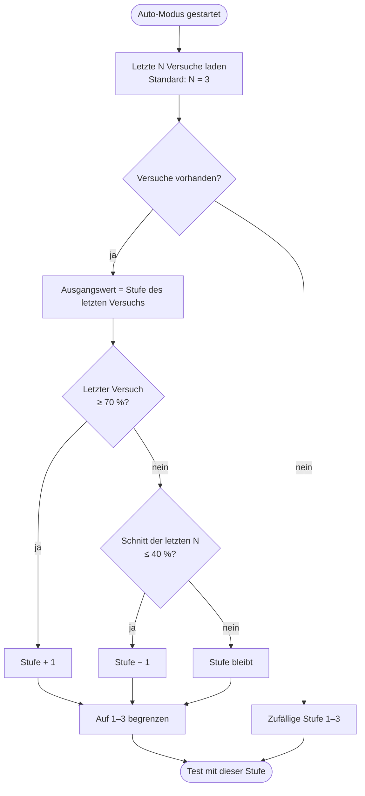

# Auto-Modus und Bewertung

Diese Seite beschreibt drei Regeln, die alle in `TestService` umgesetzt sind: wie der Auto-Modus die Schwierigkeit wählt, wie einzelne Antworten Punkte bekommen und wie daraus eine Note wird.

## Auto-Modus

Der Auto-Modus soll Lernende weder unter- noch überfordern. Er schaut dafür auf die letzten Testergebnisse und schlägt die Stufe für den nächsten Test vor: 1 = Leicht, 2 = Mittel, 3 = Schwer.



Der **Aufstieg** reagiert also schnell auf einen einzelnen guten Test, der **Abstieg** erst auf eine längere Schwächephase. Das verhindert, dass ein einzelner Ausrutscher sofort zurückstuft.

Dieselbe Berechnung liefert auch die Empfehlung auf dem Dashboard (`GET /api/test/recommend`) und auf der Ergebnisseite.

### Konfiguration

Die drei Schwellenwerte stehen in der Tabelle `config`. Der Server liest sie bei jeder Berechnung neu, Änderungen wirken also sofort. Fehlt ein Eintrag, gelten die Standardwerte aus dem Code.

```sql
-- Aufstieg erst ab 85 %
INSERT INTO config (key, value) VALUES ('progress.promote_threshold', '0.85')
ON CONFLICT (key) DO UPDATE SET value = EXCLUDED.value;

-- Durchschnitt über die letzten 5 Tests
INSERT INTO config (key, value) VALUES ('progress.window_size', '5')
ON CONFLICT (key) DO UPDATE SET value = EXCLUDED.value;
```

## Punkte je Frage

Jede Frage hat eine Punktzahl (`points`). Wie viel davon vergeben wird, hängt vom Typ ab:

| Typ | Regel |
|---|---|
| Multiple Choice, Bildfrage | Die Teilwerte der gewählten Optionen werden addiert und auf höchstens 1 begrenzt. Ist eine gewählte Option falsch, gibt es 0 Punkte. |
| Lückentext | Anteil der richtig gefüllten Lücken (gewichtet nach Teilwert) mal Punktzahl. Jede in `clozeAlternatives` hinterlegte Schreibweise zählt. |
| Freitext | Stimmt die Eingabe mit einer hinterlegten Lösung überein, gibt es die Punkte mal deren Teilwert. |

Vergleiche ignorieren Groß- und Kleinschreibung sowie Leerzeichen am Anfang und Ende.

## Notenberechnung

Aus Gesamtpunkten und Maximalpunkten entsteht ein Prozentwert. Die Grenzen für die Noten hängen leicht von der Stufe ab:

| Note | Leicht (1) | Mittel (2) | Schwer (3) |
|---|---|---|---|
| 1 | ab 90 % | ab 93 % | ab 90 % |
| 2 | ab 70 % | ab 73 % | ab 70 % |
| 3 | ab 50 % | ab 53 % | ab 50 % |
| 4 | ab 30 % | ab 33 % | ab 30 % |
| 5 | ab 10 % | ab 13 % | ab 15 % |
| 6 | darunter | darunter | darunter |

Die Note wird zusammen mit dem Versuch in `attempts.grade` gespeichert. Übermittelt der Browser keine gültige Stufe, rechnet der Server mit Stufe 2.

!!! note "Bestehensgrenze im Prüfungsmodus"
    Die im Prüfungsmodus eingestellte Bestehensgrenze (Prozent oder Punkte) ist davon unabhängig. Sie wird nur im Browser ausgewertet und entscheidet über die Anzeige „Bestanden / Nicht bestanden“.
