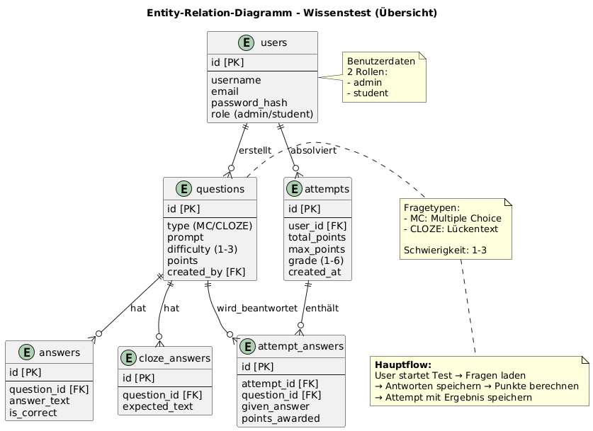
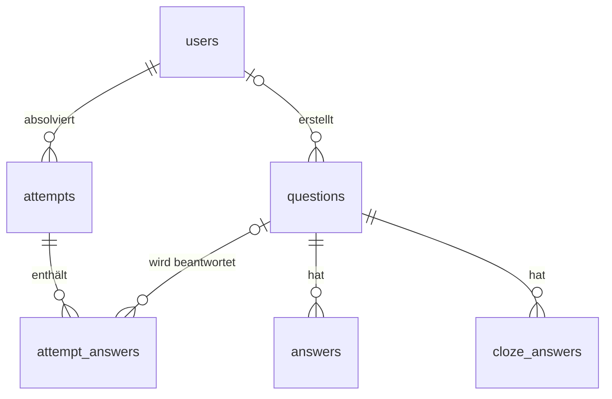

# Datenbank

Die Anwendung nutzt eine PostgreSQL-Datenbank namens `wissentest`. Die Struktur legt `db/schema.sql` an, Beispielbenutzer und -fragen kommen aus `db/seeds.sql`.

{ loading=lazy }
/// caption
Entity-Relationship-Diagramm (vereinfacht, ohne `question_images` und `config`)
///

## Beziehungen



Beim Löschen einer Frage verschwinden ihre Antwortoptionen und Lücken mit (`ON DELETE CASCADE`). In bereits gespeicherten Versuchen bleibt die Zeile erhalten, der Verweis auf die Frage wird aber auf `NULL` gesetzt. Beim Löschen eines Benutzers werden auch seine Versuche gelöscht.

## Tabellen

| Tabelle | Inhalt | wichtige Spalten |
|---|---|---|
| `users` | Konten | `username` (eindeutig), `email`, `password_hash`, `password_salt`, `role` (`student`/`admin`), `reset_requested` |
| `questions` | Fragenkatalog | `type` (`MC`, `CLOZE`, `FREE`, `IMAGE`), `prompt`, `difficulty` (1–3), `points`, `category`, `image_url`, `meta` (JSONB), `created_by` |
| `answers` | Antwortoptionen für MC-, Bild- und Freitextfragen | `question_id`, `answer_text`, `is_correct`, `partial_value` (0–1) |
| `cloze_answers` | erwartete Begriffe je Lücke | `question_id`, `token_index`, `expected_text`, `partial_value` |
| `question_images` | hochgeladene Bilder | `content_type`, `data` (BYTEA) |
| `attempts` | abgeschlossene Testversuche | `user_id`, `total_points`, `max_points`, `difficulty`, `grade`, `duration_seconds` |
| `attempt_answers` | Antwort je Frage und Versuch | `attempt_id`, `question_id`, `given_answer`, `points_awarded` |
| `config` | Einstellungen als Schlüssel/Wert | `key`, `value`, `description` |

Indizes gibt es auf `questions.difficulty` und `attempts.user_id`, weil danach am häufigsten gesucht wird.

### Metadaten einer Frage

Die Spalte `questions.meta` speichert Zusatzinformationen als JSON, ohne dass das Schema geändert werden muss. Genutzt werden zum Beispiel:

- `learnEnabled`: ob die Frage im Lernmodus als Karteikarte erscheint (fehlt der Wert, gilt `true`)
- `clozeAlternatives`: die zulässigen Schreibweisen je Lücke bei Lückentexten

### Konfiguration

| Schlüssel | Standard | Bedeutung |
|---|---|---|
| `progress.promote_threshold` | `0.70` | Aufstieg, wenn der letzte Test mindestens diesen Anteil erreicht |
| `progress.demote_threshold` | `0.40` | Abstieg, wenn der Schnitt der letzten Tests höchstens diesen Anteil erreicht |
| `progress.window_size` | `3` | Anzahl der Tests für den Durchschnitt |

Die Werte lassen sich ohne Neustart ändern, siehe [Auto-Modus und Bewertung](auto-modus.md#konfiguration).

## Verbindung

Die Zugangsdaten stehen in `mainlogik, backend/src/main/resources/db.properties` und landen beim Build in der WAR-Datei:

```properties
db.url=jdbc:postgresql://localhost:5433/wissentest
db.user=student
db.password=student
```

!!! danger "`schema.sql` löscht bestehende Daten"
    `db/schema.sql` beginnt mit `DROP TABLE IF EXISTS … CASCADE` für alle Tabellen. Wer das Skript auf einer vorhandenen Datenbank ausführt, verliert alle Benutzer, Fragen, Bilder und Ergebnisse. Für Aktualisierungen nur `db/seeds.sql` erneut ausführen; die Seeds sind so geschrieben, dass sie keine Duplikate erzeugen.
