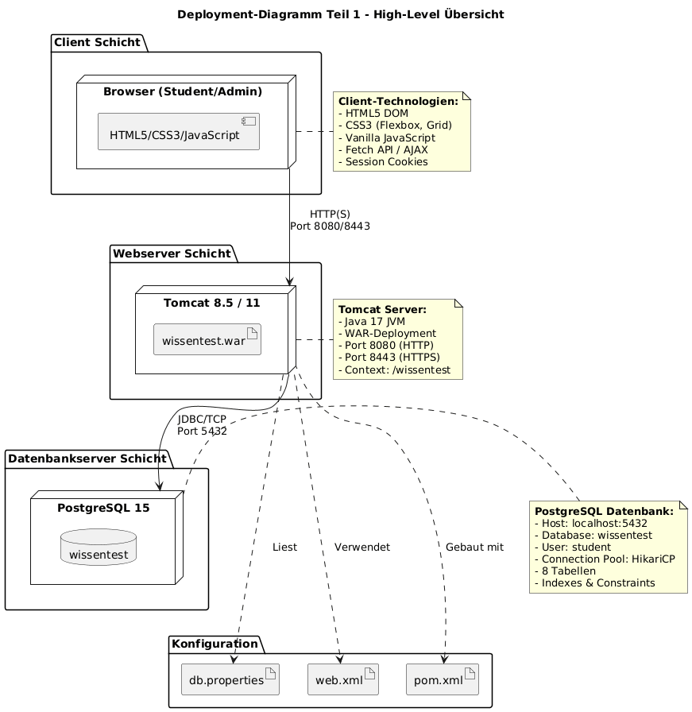
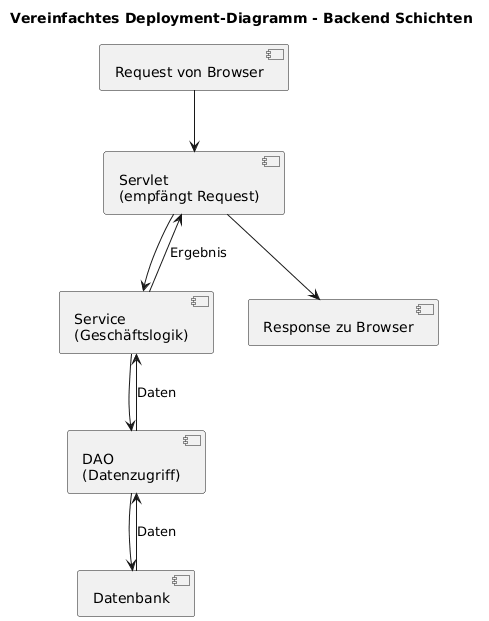
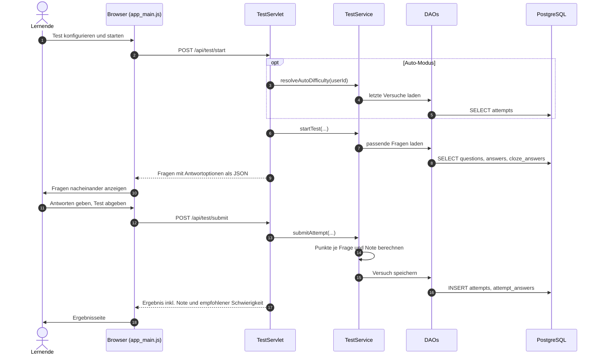
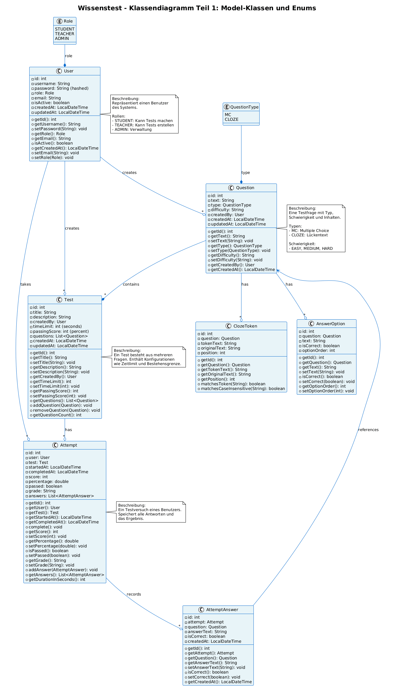

# Architektur-Überblick

Projekt Wissenstest ist eine klassische Java-Webanwendung. Sie wird als eine einzige WAR-Datei auf einem Tomcat-Server betrieben und spricht per JDBC mit einer PostgreSQL-Datenbank. Es gibt keinen separaten Frontend-Build: Die Seiten entstehen serverseitig mit JSP, die Interaktion läuft über JavaScript im Browser.

## Drei Ebenen

{ loading=lazy }
/// caption
Deployment-Diagramm: Browser, Tomcat mit `wissentest.war`, PostgreSQL
///

| Ebene | Inhalt |
|---|---|
| Client | Browser mit HTML, CSS und Vanilla JavaScript; Sitzung per Cookie |
| Webserver | Tomcat mit der Anwendung unter dem Kontextpfad `/wissentest` |
| Datenbank | PostgreSQL mit der Datenbank `wissentest` |

!!! note "Hinweise zum Diagramm"
    Das Diagramm stammt aus der Planungsphase. Zwei Punkte weichen vom aktuellen Stand ab: Die Anwendung nutzt `javax.servlet` und läuft deshalb auf Tomcat 8.5 oder 9, nicht auf Tomcat 11 (siehe [Deployment](../betrieb/deployment.md#tomcat-version)). Das lokale Startskript betreibt PostgreSQL auf Port 5433 statt 5432.

## Schichten im Backend

{ width="360" loading=lazy }
/// caption
Vereinfachtes Schichtenmodell des Backends
///

Jede Anfrage durchläuft dieselben Schichten:

1. **Web (Servlets, Filter):** nimmt HTTP-Anfragen an, prüft die Sitzung, liest und schreibt JSON.
2. **Service:** enthält die Fachlogik, zum Beispiel Fragen auswählen, Antworten bewerten, Noten berechnen.
3. **DAO / Repository:** kapselt den Datenbankzugriff per JDBC. Jede Tabelle hat ein Interface und eine JDBC-Implementierung.
4. **Model:** einfache Datenobjekte wie `User`, `Question` oder `Attempt`.

Querschnittlich liefern `DbConnectionManager` (Verbindungspool mit HikariCP) und `PasswordUtils` (Passwort-Hashing) die technische Basis. Details stehen unter [Backend](backend.md).

## Ablauf eines Tests

Das folgende Sequenzdiagramm zeigt, was zwischen Browser und Server passiert, wenn jemand einen Test macht:

Die Fragen werden in einem einzigen Aufruf geladen; Punkte und Note berechnet erst beim Abgeben der Server.

!!! warning "Bekannte Schwachstelle"
    Die Antwort von `POST /api/test/start` enthält im aktuellen Stand auch das Feld `correct` der Antwortoptionen und bei Lückentexten die erwarteten Begriffe (`expectedText`). Wer die Entwicklerwerkzeuge des Browsers öffnet, kann die Lösungen also während des Tests sehen. Für eine echte Prüfungssituation sollten diese Felder vor dem Versand entfernt werden (in `TestServlet.buildQuestionView`).

## Entwurfsmodell

{ loading=lazy }
/// caption
Klassendiagramm aus der Entwurfsphase (Model-Klassen)
///

!!! note "Entwurf und Umsetzung"
    Das Klassendiagramm zeigt den ursprünglichen Entwurf. In der Umsetzung gibt es keine eigene Klasse `Test` und kein `Role`-Enum: Tests werden bei jedem Start dynamisch aus dem Fragenkatalog zusammengestellt, die Rolle ist ein Textfeld (`student` oder `admin`). Außerdem kamen die Fragetypen `FREE` und `IMAGE` hinzu. Den aktuellen Stand beschreiben die Seiten [Backend](backend.md) und [Datenbank](datenbank.md).
