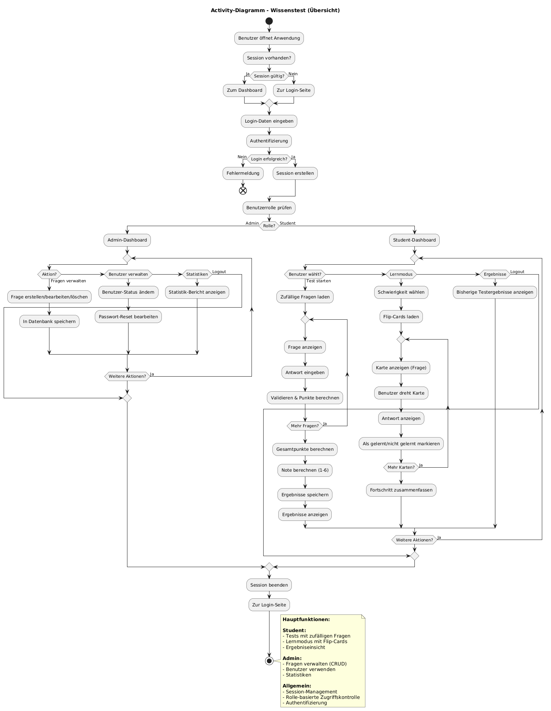

# Für Lernende

Diese Seite beschreibt, wie Lernende die Plattform nutzen: vom Konto über Tests und Prüfungen bis zum Lernmodus.

## Konto und Anmeldung

- **Registrieren:** Benutzername, E-Mail und Passwort eingeben. Der Benutzername muss 3 bis 50 Zeichen lang sein und darf nur Buchstaben, Ziffern, Punkt, Unterstrich und Bindestrich enthalten. Das Passwort braucht mindestens 6 Zeichen.
- **Anmelden:** Nach erfolgreichem Login legt der Server eine Sitzung an. Alle weiteren Seiten nutzen diese Sitzung.
- **Passwort vergessen:** Über den Link auf der Login-Seite wird eine Reset-Anfrage gestellt. Sie erscheint im Admin-Panel. Eine Lehrkraft setzt dort ein neues Passwort.

## Einen Test starten

Nach dem Login öffnet sich das Dashboard (**Tests**). Oben stehen die eigene Rolle, die Zahl der bestandenen Tests und die aktuell empfohlene Schwierigkeit. Darunter wird der **Allgemeine Wissenstest** zusammengestellt:

| Einstellung | Auswahl |
|---|---|
| Kategorie | eine Kategorie oder „Alle Kategorien“ |
| Anzahl Fragen | 5, 10 oder 20 |
| Modus | **Auto (Empfohlen)**, Leicht (Training), Mittel (Prüfung) oder Schwer (Experte) |

Über **Benutzerdefinierter Test** öffnet sich ein Dialog mit mehr Optionen: mehrere Kategorien gleichzeitig, 5 bis 30 Fragen und ein Zeitlimit von 5 bis 30 Minuten. Ganz unten zeigt das Dashboard die letzten eigenen Ergebnisse.

!!! tip "Auto-Modus"
    Bei „Auto“ wählt das System die Schwierigkeit anhand der letzten Ergebnisse. Wer im letzten Test mindestens 70 % erreicht hat, bekommt die nächsthöhere Stufe. Liegt der Schnitt der letzten drei Tests bei höchstens 40 %, geht es eine Stufe nach unten. Details stehen unter [Auto-Modus und Bewertung](../architektur/auto-modus.md).

## Während des Tests

- Die Fragen erscheinen einzeln, mit Fortschrittsbalken und Countdown.
- **Nächste Frage** springt weiter, **Test abgeben** beendet den Test vorzeitig.
- Ein Test kann über **Abbrechen** verlassen werden. Das Ergebnis wird dann nicht gespeichert.

Die Fragetypen:

| Typ | So wird geantwortet | Bewertung |
|---|---|---|
| Multiple Choice | eine oder mehrere Antworten anklicken | volle Punkte, sobald nur richtige Optionen gewählt sind; eine falsch gewählte Option ergibt 0 Punkte |
| Bildfrage | wie Multiple Choice, mit Abbildung | wie Multiple Choice |
| Lückentext | Begriffe in die Lücken eintragen | anteilig je richtig gefüllter Lücke, Groß-/Kleinschreibung egal |
| Freitext | Antwort frei eintippen | Vergleich mit hinterlegten Lösungen, Groß-/Kleinschreibung egal |

## Ergebnis

Nach der Abgabe zeigt die Ergebnisseite:

- erreichte Punkte (z. B. `14 / 20 Punkte`),
- die **Note von 1 bis 6**, die der Server berechnet,
- auf Wunsch eine Detailansicht mit eigener Antwort, richtiger Lösung und Punkten je Frage,
- eine Empfehlung für die Schwierigkeit des nächsten Tests.

Wie die Note entsteht, steht unter [Auto-Modus und Bewertung](../architektur/auto-modus.md#notenberechnung).

## Prüfungsmodus

Der Prüfungsmodus (**Prüfung** in der Navigation) ist für eine ernsthafte Selbstprüfung gedacht. Im Prüfungskonfigurator werden festgelegt:

- **Anzahl Fragen** (5 bis 200) und **Zeitlimit** (1 bis 180 Minuten),
- die **Zusammensetzung** als Regeln aus Kategorie, Fragetyp, Stufe und Anteil in Prozent, z. B. „60 % Klassendiagramme, Stufe Mittel“ und „40 % Lückentexte, alle Stufen“ (ohne Regeln wird zufällig gemischt),
- die **Bestehensgrenze** in Prozent oder Punkten.

Die Bestehensgrenze entscheidet nur über die Anzeige „Bestanden / Nicht bestanden“. Die Note wird weiterhin wie bei jedem Test berechnet.

## Lernmodus

Im Lernmodus (**Lernen**) erscheinen alle Fragen, die von einer Lehrkraft als Karteikarte freigegeben wurden, als Karteikarten:

- Vorderseite: Frage, bei Bildfragen mit Abbildung
- Rückseite: richtige Antwort
- Ein Klick dreht die Karte, **Vergrößern** öffnet sie groß in einem Dialog.

Im Lernmodus gibt es keine Punkte und keine Zeitbegrenzung.

{ loading=lazy }
/// caption
Aktivitätsdiagramm: Ablauf für Lernende (rechts) und Admins (links)
///
