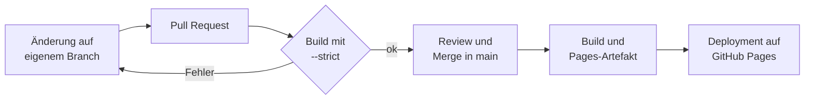

# Über diese Doku

Dieses Handbuch ist eine statische Website. Sie wird mit dem Static-Site-Generator **MkDocs** und dem Theme **Material for MkDocs** aus Markdown-Dateien erzeugt und über **GitHub Pages** veröffentlicht. Den Build und die Veröffentlichung übernimmt **GitHub Actions**.

## Aufbau im Repository

```text
projekt-wissenstest/
├── mkdocs.yml                  # Konfiguration: Navigation, Theme, Erweiterungen
├── requirements-docs.txt       # fest gepinnte Versionen von MkDocs und Material
├── .github/workflows/docs.yml  # Build und Veröffentlichung
└── handbuch/                   # Inhalte in Markdown
    ├── index.md
    ├── nutzung/
    ├── architektur/
    ├── betrieb/
    └── assets/diagramme/
```

Die älteren Notizen im Ordner `docs/` bleiben unverändert im Repository, sind aber nicht Teil dieser Website.

## Vom Commit zur Website



1. Änderungen entstehen auf einem eigenen Branch und kommen per Pull Request nach `main`.
2. Für jeden Pull Request baut der Workflow die Seite mit `mkdocs build --strict`. Defekte interne Links oder Seiten, die in der Navigation fehlen, lassen den Build scheitern.
3. Nach dem Merge baut der Workflow die Seite erneut, lädt sie als Pages-Artefakt hoch und veröffentlicht sie über die Umgebung `github-pages`.

Der Deployment-Job hat nur die Rechte `pages: write` und `id-token: write`, der Build-Job nur Leserechte auf den Code.

## Lokal ansehen und bearbeiten

```bash
pip install -r requirements-docs.txt
mkdocs serve
```

Die Vorschau läuft dann unter <http://127.0.0.1:8000/> und aktualisiert sich bei jeder gespeicherten Änderung.

## Warum die Versionen fest gepinnt sind

`requirements-docs.txt` legt MkDocs auf 1.6.1 und Material for MkDocs auf 9.7.6 fest. Das hat zwei Gründe:

- Material for MkDocs befindet sich seit November 2025 im Wartungsmodus und erhält nur noch Fehler- und Sicherheitskorrekturen.
- MkDocs 2.0 ist nicht mit Material kompatibel: Das Plugin-System entfällt, und die Konfiguration wechselt von YAML zu TOML.

Mit den festen Versionen bleibt der Build reproduzierbar. Da die Inhalte reines Markdown sind, ist ein späterer Wechsel des Generators, etwa zu Zensical, mit überschaubarem Aufwand möglich.

## Einmalige Einrichtung in GitHub

Damit der Workflow veröffentlichen darf, muss GitHub Pages einmalig auf Actions umgestellt werden: **Settings → Pages → Build and deployment → Source: GitHub Actions**.
